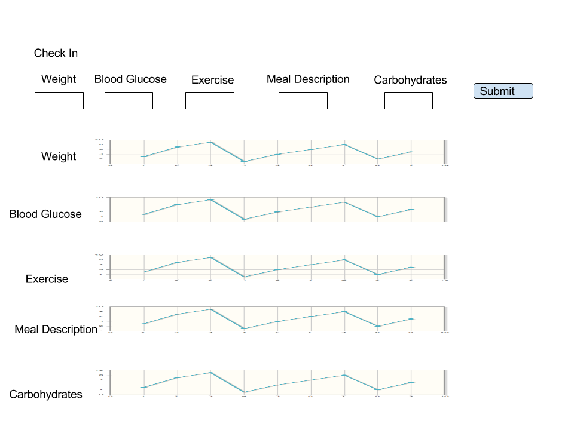

# Diabetic Management Application Prototyping

Author: Cyrus Shahrivar
Date: 4/5/2016

## Outline of Concept
- 3 screen app (homescreen, login screen, settings screen)
- Include forms to allow for input of vitals
- Graph vitals after hitting update button
- Hit USDA API to show food information
  - It might be good to split the string up and search each meal component, or have form fill-in of each part of the meal, then do the search for nutrition information.
  - It might be good to have an easy way to adjust the amount of food had that isn't just form input, but maybe a "volume control" type of input

## Image Concept

## To Do's
- Need to think about how to make the application better than a spreadsheet or paper log
  - There's a lot of applications out there that track food and calories.
  - There's a lot of applications out there that track blood glucose.
  - There's a lot of applications out there that track exercise.
  - There's a lot of applications out there that track water intake.
- Need to strongly thing about user interaction and experience
  - Should most movements for phone involve buttons rather than text fields?
  - Should most movements for desktop involve text fields rather than buttons?
  - What should the color scheme be?
  - It should take less than a minute to enter everything and get a recommendation.  Most people are on the go and are impatient to spend 5 minutes here and there to focus.  The application should focus on being quick to use and easy on the eyes.
- Need to come up with User Stories - DONE (TRELLO)
